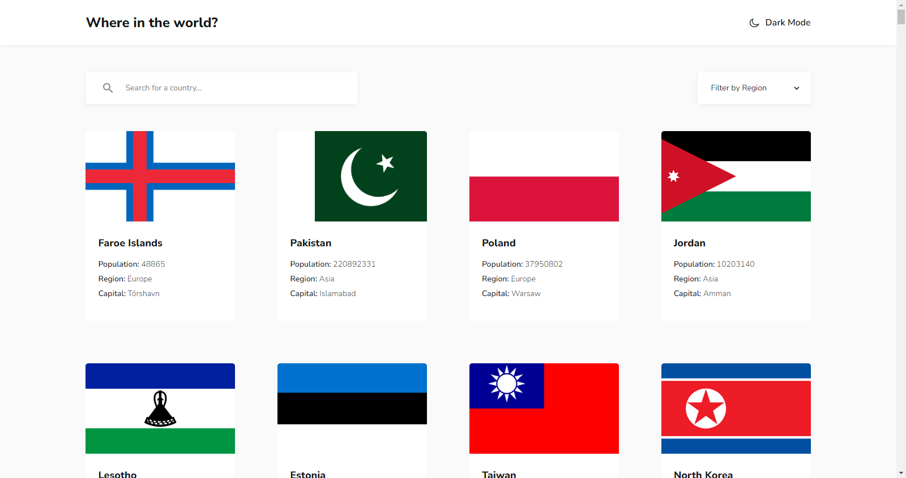
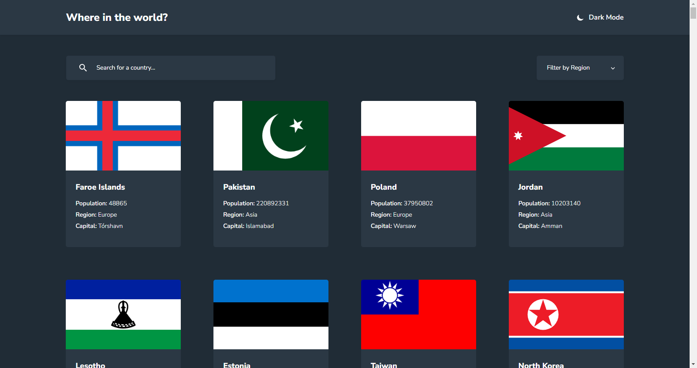
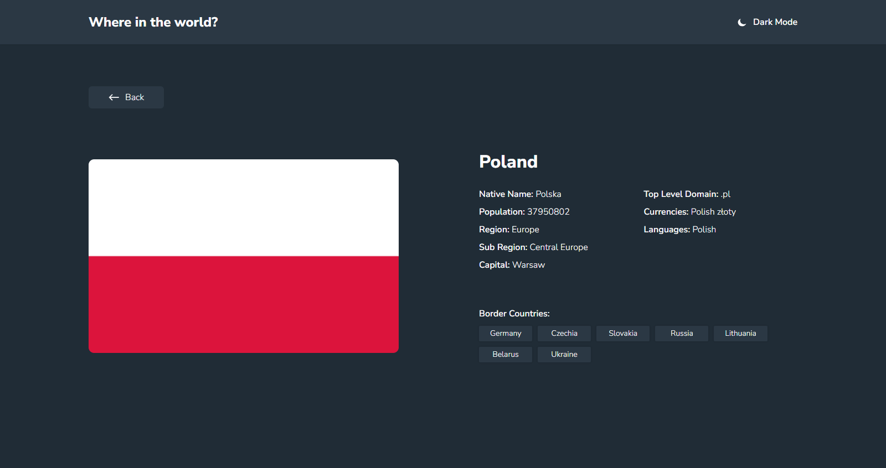
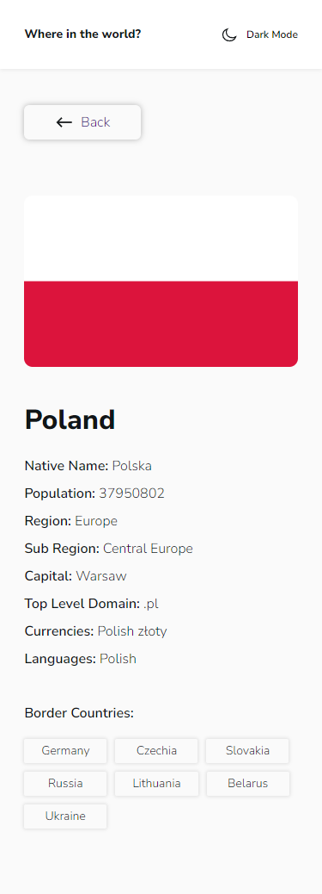

# Frontend Mentor - REST Countries API with color theme switcher solution

This is a solution to the [REST Countries API with color theme switcher challenge on Frontend Mentor](https://www.frontendmentor.io/challenges/rest-countries-api-with-color-theme-switcher-5cacc469fec04111f7b848ca). Frontend Mentor challenges help you improve your coding skills by building realistic projects. 

### The challenge

Users should be able to:

- See all countries from the API on the homepage
- Search for a country using an `input` field
- Filter countries by region
- Click on a country to see more detailed information on a separate page
- Click through to the border countries on the detail page
- Toggle the color scheme between light and dark mode *(optional)*

### Screenshot
I am delighted to share with you a screenshot of my solution to the rest-countries-api challenge. My goal in developing this solution was to create an interface that is both visually stunning and highly functional. Users can search for countries by name, region, or subregion, and filter their results based on a range of criteria such as population, area, and currency. Each country is displayed in a visually appealing layout that provides users with detailed information such as the country's flag, capital city, and languages spoken. I believe that my solution is a significant improvement over traditional country search interfaces and I am excited to hear your thoughts and feedback.

### Links

- Live Site URL: [rest-countries-api](https://rest-countries-api-two-lime.vercel.app/)

### Built with

- Semantic HTML5 markup
- CSS custom properties
- SASS/SCSS
- [Axios](https://axios-http.com/) - Promise based HTTP client for the browser and node.js
- [React](https://reactjs.org/) - JS library

## Author

- Website - [Jownsu](https://jownsu.github.io/)
- Frontend Mentor - [@jownsu](https://www.frontendmentor.io/profile/jownsu)
- Instagram - [jownsu](https://www.instagram.com/jownsu/)
- Linked In - [Jhones](https://www.linkedin.com/in/jhones-digno-866904213/)